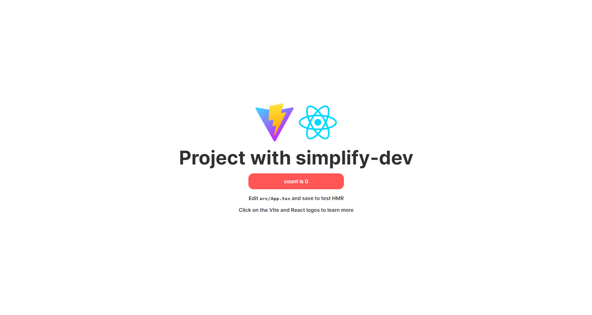

# Samplify-dev

---

## About package:
Samplify-dev is React library with polymorphic ui components styled with tailwindcss.

---

## Quick start:

### 1. Init your project
**Example:**
```bash
npm create vite@latest my-app --template react-ts
```

### 2.  Install packages and init config files:
Install simplify-dev, tailwindcss and its peer dependencies, then generate your tailwind.config.js and postcss.config.js files.
```bash
npm i simplify-dev
npm i -D tailwindcss postcss autoprefixer
npx tailwindcss init -p
```

### 3. Setup configuration
#### Configure your tailwind.config.js:
Add the paths to all of your template files in your tailwind.config.js file.
```js
import {tailwindSimplifyPlugin, tailwindSimplifyPreset} from "simplify-dev";

/** @type {import('tailwindcss').Config} */
export default {
  content: [
    "./index.html",
    "./src/**/*.{js,ts,jsx,tsx}",
    "./node_modules/simplify-dev/**/*.{js,ts}" // styling simplify-dev components 
  ],
  theme: {
    extend: {
        // your configuration
    },
  },
  plugins: [tailwindSimplifyPlugin],
  presets: [tailwindSimplifyPreset]
}
```
You can see that we add simplify-dev files to tailwindcss content. This is done to simplify the customization of components via tailwind.config.js

### 4. Add the Tailwind directives to your CSS
Add the @tailwind directives for each of Tailwind’s layers to your ./src/index.css file.
```
@tailwind base;
@tailwind components;
@tailwind utilities;
```

### 5. Start your build process
Run your build process with npm run dev.
```bash
npm run dev
```

### 6. Start using simplify-dev in your project
**Eexample:**
```js
export default function App() {
  const [count, setCount] = useState(0)

  return (
    <Box as="section" className="flex flex-col items-center justify-center gap-5 min-h-screen">
      <Box className="flex justify-center">
        <Button as="a" buttonType="text" href="https://vitejs.dev" target="_blank">
          
        </Button>
        <Button as="a" buttonType="text" href="https://react.dev" target="_blank">
          
        </Button>
      </Box>
      <Typography as="h1">Project with simplify-dev</Typography>
        <Button as="button" variant="reject" className="w-[300px]" onClick={() => setCount((count) => count + 1)}>
          count is {count}
        </Button>
        <Typography>
          Edit <code>src/App.tsx</code> and save to test HMR
        </Typography>
      <Typography className="read-the-docs">
        Click on the Vite and React logos to learn more
      </Typography>
    </Box>
  )
}
```
**Result:**


---

## UI Components:
1. Typography
2. Box
3. Button
4. Input
5. Checkbox
6. Toggle

---

## Hooks:
1. useDebounce
2. useFocus
3. useForwardRef
4. useValidate
5. useWidth
